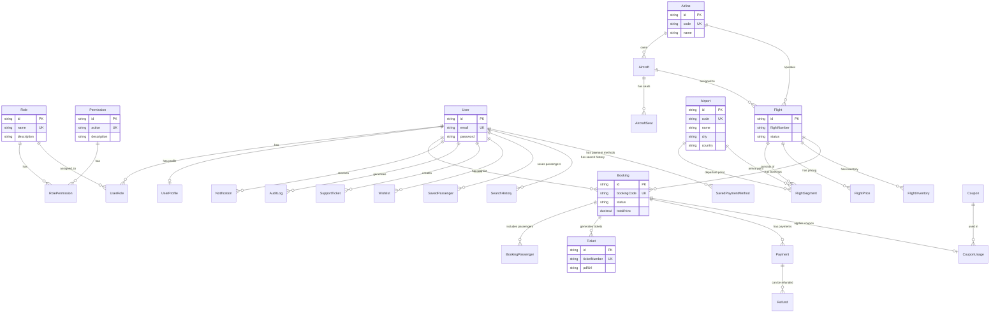

# Flight Booking System ERD

```mermaid
erDiagram
    Role ||--o{ RolePermission : has
    Permission ||--o{ RolePermission : has
    User ||--o{ UserRole : has
    Role ||--o{ UserRole : assigned_to
    User ||--o| UserProfile : "has profile"
    User ||--o{ Booking : makes
    User ||--o{ Notification : receives
    User ||--o{ AuditLog : generates
    User ||--o{ SupportTicket : creates
    User ||--o{ Wishlist : "has wishlist"
    User ||--o{ SavedPassenger : "saves passengers"
    User ||--o{ SearchHistory : "has search history"
    User ||--o{ SavedPaymentMethod : "has payment methods"

    Airline ||--o{ Aircraft : owns
    Airline ||--o{ Flight : operates
    Airport ||--o{ FlightSegment : "departure point"
    Airport ||--o{ FlightSegment : "arrival point"
    Aircraft ||--o{ AircraftSeat : "has seats"
    Aircraft ||--o{ Flight : "assigned to"

    Flight ||--o{ FlightSegment : "consists of"
    Flight ||--o{ FlightPrice : "has pricing"
    Flight ||--o{ FlightInventory : "has inventory"
    Flight ||--o{ Booking : "has bookings"

    Booking ||--o{ BookingPassenger : "includes passengers"
    Booking ||--o{ Ticket : "generates tickets"
    Booking ||--o{ Payment : "has payments"
    Booking ||--o| CouponUsage : "applies coupon"
    Coupon ||--o{ CouponUsage : "used in"

    Payment ||--o{ Refund : "can be refunded"

    Role {
        string id PK
        string name UK
        string description
    }

    Permission {
        string id PK
        string action UK
        string description
    }

    User {
        string id PK
        string email UK
        string password
    }

    Airline {
        string id PK
        string code UK
        string name
    }

    Airport {
        string id PK
        string code UK
        string name
        string city
        string country
    }

    Flight {
        string id PK
        string flightNumber
        string status
    }

    Booking {
        string id PK
        string bookingCode UK
        string status
        decimal totalPrice
    }

    Ticket {
        string id PK
        string ticketNumber UK
        string pdfUrl
    }
```
